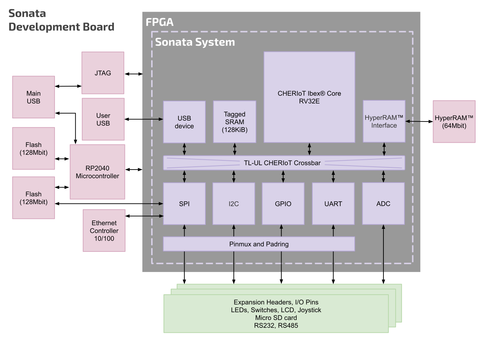
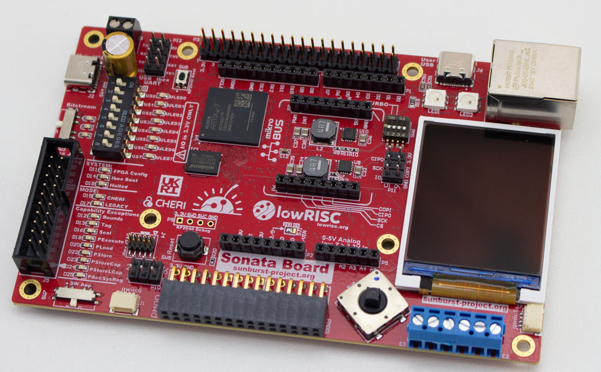

# Sonata system

Sonata is a system for evaluating the usage of the [CHERIoT Ibex core](https://github.com/microsoft/cheriot-ibex) as a microcontroller for embedded, IoT and Operational Technology applications.
The system contains a number of peripherals (I2C, SPI, GPIO, USB, and UART) and the CHERIoT Ibex core itself.
It is designed for use on FPGA and specifically targets the [Sonata FPGA board](https://github.com/newaetech/sonata-pcb), but as the entire design is open-source (from PCB to software), it can be run on any similar system.

This project is designed to look like a normal microcontroller in terms of usability, including SDK, examples, and normal capabilities such as debuggers.
But underneath that the [CHERIoT](https://www.microsoft.com/en-us/research/publication/cheriot-rethinking-security-for-low-cost-embedded-systems/) capabilities provides a high level of "default security" that simplifies designing embedded systems in a secure manner.
You can see the [complete documentation](https://lowrisc.github.io/sonata-system/) for the project.
Sonata is part of the [Sunburst Project](https://www.sunburst-project.org) funded by [UKRI](https://www.ukri.org/) / [DSbD](https://www.dsbd.tech/) under grant number 107540.

## Current status

We are delighted to announce the release of the Sonata system!
The latest release is available on GitHub [here][releases].

This new release provides a base FPGA image with I2C/SPI/UART peripherals that are suitable for use with the expansion headers as well as the on-board hardware.

On the software side a full build flow for Microsoft's CHERIoT RTOS is available along with driver support for the Sonata peripherals in the [sonata-software repository][sonata-software].
A flash bootloader enables easy 'drag and drop' programming where a generated UF2 is copied to Sonata’s virtual USB drive (in a similar manner to the RP2040 and arm Mbed platforms).
Environment setup and build instructions are available for Windows, macOS and Linux.

If you find any issues with the Sonata system, or have features you would like to propose, please [create an issue on GitHub][create-issue].
For support with the board itself please use the [forum][newae-forum] on the NewAE website, create an issue on the [sonata-pcb repository][sonata-pcb], or reach out to NewAE directly.

[releases]: https://github.com/lowRISC/sonata-system/releases
[sonata-software]: https://github.com/lowRISC/sonata-software
[create-issue]: https://github.com/lowRISC/sonata-system/issues/new
[newae-forum]: https://forum.newae.com/c/sonata-board/15
[sonata-pcb]: https://github.com/newaetech/sonata-pcb

## Getting started

If you have a Sonata board, you can jump to the [Getting Started](doc/guide) guide. This will walk you through plugging in the board, building example software, and programming the software. For more advanced usage, you can see a [Reference Manual](doc/dev/ref-manual.md) similar to what a normal microcontroller reference manual (peripherals, features, etc.) and then see the [FPGA development](doc/dev/fpga-programming.md) flow if you wish to modify the soft-core itself.

You can also work with a simulated environment, and there is a nice guide on this in the [sonata-software documentation][sonata-sim]. This simulates the entire in Verilator, allow you to develop both hardware (the FPGA) and software (running code) programs.

[sonata-sim]: https://lowrisc.github.io/sonata-software/doc/guide/running-software.html#running-in-the-simulator

## Documentation introduction

This documentation is built using [mdBook](https://rust-lang.github.io/mdBook/). If you are reading this file in GitHub, you should instead see the pre-built documentation on the [lowRISC Website](https://lowrisc.github.io/sonata-system/) which includes the full documentation.

If you'd like to build a copy of the documentation locally, see the [Building Documentation](doc/dev/building-doc.md) page.

## License

Unless otherwise noted, everything in the repository is covered by the [Apache License](https://www.apache.org/licenses/LICENSE-2.0.html), Version 2.0. See the [LICENSE](https://github.com/lowRISC/sonata-system/blob/main/LICENSE) file for more information on licensing.
