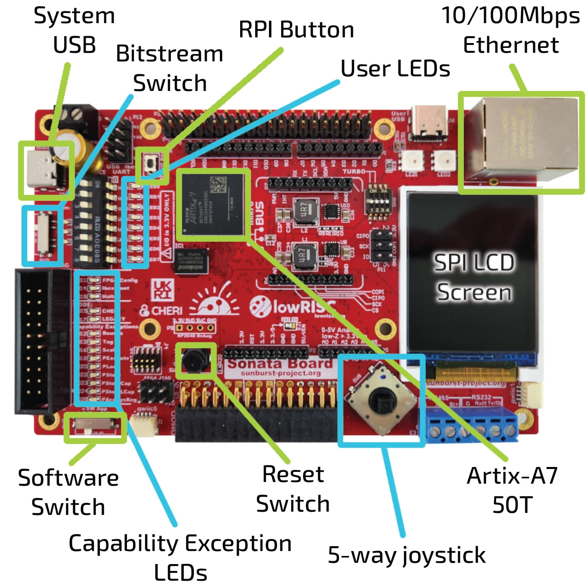
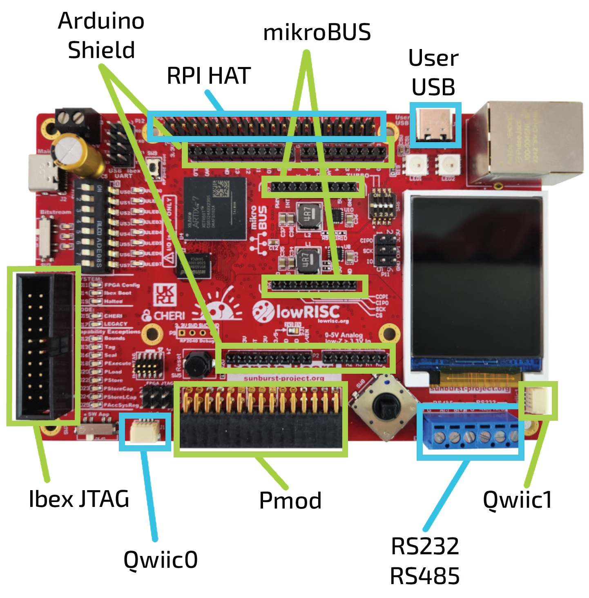

# Sonata Board Reference

This section focusses on what needs to be physically present on the board and explicitly leaves the configuration of the FPGA and the software for other sections. The Sonata board has the features shown here:

## Configuration

The 'usable' requirement makes it worth thinking well about configuration.
We want to provide multiple bitstreams and software images that can be switched between on the board without having to reprogram it.
This is why we have a switch for bitstream and a switch for software images.

For example, we could have a CHERI and non-CHERI bitstream both available on the board.
For software, we can switch between demo applications, for example CHERI compartmentalization versus CHERI exceptions.
Introducing these physical switches also fulfills the 'interactive' requirement.

To make multiple bitstreams available, we introduce a USB connector that looks like mass storage to a user, where multiple bitstreams can be stored and changed without hassle.
There is an RP2040 on the board to manage these configurations.

Also part of this 'usable' requirement is to have enough memory to store the bitstreams and software.
We introduce two separate flash chips for these purposes and a HyperRAM chip.

## Peripherals

The 'connectable' requirement means that we need to introduce common peripherals on the board.
After consultation with the community, we settled on the following list:
- Ethernet
- RS-232
- RS-485
- MicroSD
- ADC

## Headers

For both the 'connectable' and 'extendable' requirements, we provide a number of headers so that custom functionality can be added:
- Raspberry Pi header
- Arduino shield (only 3.3V versions supported)
- microBUS Click
- Sparkfun QWIIC
- PMOD
- 30-pin R/A header

Although, the FPGA pins can be used independently, due to the physical layout of the headers on the FPGA board, it is not possible to plug in Raspberry Pi, Arduino shield and MicroBus click headers simultaneously.
You can still use them simultaneously with modified wiring.

The 2 PMODs and the R/A header cannot be used at the same time since they use the same pins.
We don't expect this to be a problem as most applications should only need to use one expansion board.

## Debug

For ease of use, we have one USB connector that can power the board as well as debug using JTAG and two virtual UARTs.
This means that users only have to connect one cable.
Besides the JTAG over USB, we provide external JTAG and UART headers to enable users to use different setups if they need to.

## User interface

The user interface is where we address the 'CHERI-visible' and 'interactive' requirements.
In terms of user input, we have:
- DIP switches
- Button
- Joystick

In terms of output, we have:
- LEDs
- LCD screen
- CHERI-specific capability exception LEDs

## Affordable

In order to meet the 'affordable' requirement, we choose a low-end FPGA to reduce the costs.
We choose a Xilinx Artix 7 FPGA because it has a typical amount of memory for embedded use-cases while being able to clock the design higher than similarly priced alternatives and being supported by many tools.

## Technical details

If you want to know more details on what the actual design looks like, please have a look at [NewAE's repository of the Sonata PCB](https://github.com/newaetech/sonata-pcb).

This includes the entire design sources, available currently in Altium, with a KiCad version being released shortly.

## Schematic Link

You can find a [direct link to the schematics](https://github.com/newaetech/sonata-pcb/blob/main/sonata-schematics-r08.pdf) for your reading pleasure.