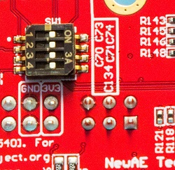
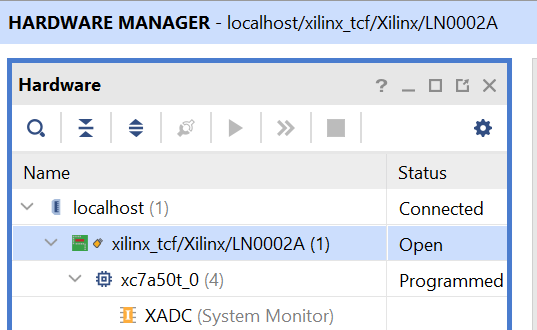

# FPGA Programming

## Drag & Drop Programming

The easiest way to program the FPGA is to use the built-in programming feature. This reads a .bit file you drag onto the USB
drive that comes up when the USB is plugged in, and will program it into the FPGA. This will also save it to SPI flash in
one of the three "Slots", and will automatically reprogram on board power-on.

Using this drag & drop programming is the suggested way of updating the board with "normal" Sonata core images. For development
it's suggested to use the JTAG programmer, as it will be much faster and avoids lots of writes to the SPI flash.

## JTAG Programming Using On-Board FTDI Chip

The Sonata board includes a FTDI chip that can program the FPGA. This also allows usage inside of Vivado to access features such as Integrated Logic Analyzer (ILA) blocks.

On the backside of the board, confirm switches SW1 are all set to **ON** as shown in this photo (this was the state the board is shipped in,
so if you haven't touched the switches it should still be in that state):



The switches in the "off" state will isolate the FTDI and allow you to use an external JTAG probe (such as Xilinx Platform Cable USB II).

### USB rules for Linux

To allow openFPGAloader to program our device, add the following rules:
```sh
sudo su
cat <<EOF > /etc/udev/rules.d/99-openfpgaloader.rules
# Copy this file to /etc/udev/rules.d/

ACTION!="add|change", GOTO="openfpgaloader_rules_end"

# gpiochip subsystem
SUBSYSTEM=="gpio", MODE="0664", GROUP="plugdev", TAG+="uaccess"

SUBSYSTEM!="usb|tty|hidraw", GOTO="openfpgaloader_rules_end"

# Original FT232/FT245 VID:PID
ATTRS{idVendor}=="0403", ATTRS{idProduct}=="6001", MODE="664", GROUP="plugdev", TAG+="uaccess"

# Original FT2232 VID:PID
ATTRS{idVendor}=="0403", ATTRS{idProduct}=="6010", MODE="664", GROUP="plugdev", TAG+="uaccess"

# Original FT4232 VID:PID
ATTRS{idVendor}=="0403", ATTRS{idProduct}=="6011", MODE="664", GROUP="plugdev", TAG+="uaccess"

# Original FT232H VID:PID
ATTRS{idVendor}=="0403", ATTRS{idProduct}=="6014", MODE="664", GROUP="plugdev", TAG+="uaccess"

# Original FT231X VID:PID
ATTRS{idVendor}=="0403", ATTRS{idProduct}=="6015", MODE="664", GROUP="plugdev", TAG+="uaccess"

# anlogic cable
ATTRS{idVendor}=="0547", ATTRS{idProduct}=="1002", MODE="664", GROUP="plugdev", TAG+="uaccess"

# altera usb-blaster
ATTRS{idVendor}=="09fb", ATTRS{idProduct}=="6001", MODE="664", GROUP="plugdev", TAG+="uaccess"
ATTRS{idVendor}=="09fb", ATTRS{idProduct}=="6002", MODE="664", GROUP="plugdev", TAG+="uaccess"
ATTRS{idVendor}=="09fb", ATTRS{idProduct}=="6003", MODE="664", GROUP="plugdev", TAG+="uaccess"

# altera usb-blasterII - uninitialized
ATTRS{idVendor}=="09fb", ATTRS{idProduct}=="6810", MODE="664", GROUP="plugdev", TAG+="uaccess"
# altera usb-blasterII - initialized
ATTRS{idVendor}=="09fb", ATTRS{idProduct}=="6010", MODE="664", GROUP="plugdev", TAG+="uaccess"

# dirtyJTAG
ATTRS{idVendor}=="1209", ATTRS{idProduct}=="c0ca", MODE="664", GROUP="plugdev", TAG+="uaccess"

# Jlink
ATTRS{idVendor}=="1366", ATTRS{idProduct}=="0105", MODE="664", GROUP="plugdev", TAG+="uaccess"

# NXP LPC-Link2
ATTRS{idVendor}=="1fc9", ATTRS{idProduct}=="0090", MODE="664", GROUP="plugdev", TAG+="uaccess"

# NXP ARM mbed
ATTRS{idVendor}=="0d28", ATTRS{idProduct}=="0204", MODE="664", GROUP="plugdev", TAG+="uaccess"

# icebreaker bitsy
ATTRS{idVendor}=="1d50", ATTRS{idProduct}=="6146", MODE="664", GROUP="plugdev", TAG+="uaccess"

# orbtrace-mini dfu
ATTRS{idVendor}=="1209", ATTRS{idProduct}=="3442", MODE="664", GROUP="plugdev", TAG+="uaccess"

LABEL="openfpgaloader_rules_end"

EOF

exit

```

Run the following to reload the rules:
```sh
sudo udevadm control --reload-rules
sudo udevadm trigger
```

Add user to plugdev group:
```sh
sudo usermod -a $USER -G plugdev
```

### Programming with openFPGALoader (Linux/MacOS)

Programming the FPGA:
```sh
openFPGALoader -c ft4232 build/lowrisc_sonata_system_0/synth-vivado/lowrisc_sonata_system_0.bit
```

You can also check if the flag `--read-register STAT` is available (newer than 0.12.2 is needed) which will print detailed information about the configuration status with a recent version of openFPGALoader. This is especially helpful if you are trying to understand why the `DONE` LED is not coming on:

```sh
$ openFPGALoader -c ft4232 build/lowrisc_sonata_system_0/synth-vivado/lowrisc_sonata_system_0.bit --read-register STAT

CRC Error      No CRC error
Part Secured   0
MMCM lock      1
DCI match      1
EOS            0
GTS CFG B      0
GWE            0
GHIGH B        0
MODE           7
INIT Complete  1
INIT B         0
Release Done   0
Done           0
ID Error       ID error
DEC Error      0
XADC Over temp 0
STARTUP State  0
Reserved       0
BUS Width      x1
Reserved       8
```

In this example there is an `ID error` that means the wrong bitstream was used (e.g., built for an A35, A75, or A100 and not for the A50).

### Vivado (Windows)

The FTDI on the board is setup to work with Vivado, and should be detected on a **recent version of Vivado** (tested with 2023.2), older
 versions will not work. It also doesn't seem to currently work on Linux, although it "should" be supported according to Xilinx.



#### Reloading the FTDI Chip

The FT4232H on the board needs to be programmed *by Vivado* to work within Vivado. This is done from the TCL Console within Vivado.

With a blank FTDI chip, you would run the command:

```
program_ftdi -write -ftdi=FT4232H -serial LNXXXX -board "Sonata"
```

Where `LNXXXX` is the serial number on the sticker of the board (the serial number is optional, but with a serial number set the related
COM ports will always come up on Windows with the same COM port number, which can be helpful).

This will fail if the FTDI chip was programmed before. If you need to erase an FTDI chip, you would run the command:

```
program_ftdi -erase
```

> The `program_ftdi` command can also be run from the system command prompt with the Vivado path setup.

#### Using nix
Alternatively, you can use the nix command to load the bitstream.
```shell
nix run .#bitstream-load
```

## JTAG Programming Using External Probe

If using an external probe, you need to connect to P10, labeled `FPGA JTAG`. This is normally done with flying wire leads.

Be sure you set all of the 4-position DIP switches within SW1 to **OFF** on the bottom of the board, otherwise your external JTAG probe
will be fighting with the FTDI lines. This will cause unreliable operation.
