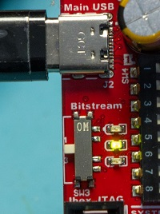
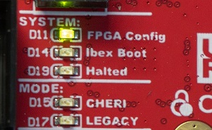

# Reloading the FPGA Image

The first thing you should do before building the firmware is to get the latest version of the FPGA image, called the "bitstream". This contains the configuration
for the microcontroller core & peripherals. The "release version" of the bitstream *must* match the
configuration you use to build the software, as if the bitstream is a different version than what
the software is expecting, you are not going to have fun!

When you download a release from the Sonata System page, you'll have a matching bitstream and
software setup.

While you can build your own bitstream as described
in [FPGA Development](../dev/fpga-development.md), we recommend starting with our prebuilt bitstream first. Building the bitstream requires
installing Vivado which takes a large amount of hard drive space and requires a separate manual installation process (as well as the build
process is much slower than a software compile, so adds delay until you can play with CHERIoT).

## Selecting a Bitstream

When the Sonata board is plugged in, it loads one of three bitstreams. This is selected by the switch below the USB port labeled `Bitstream`:


The LEDs besides the switch show the current image selected as well for confirmation.

The slot used by a bitstream is selected by the uf2 file.
The bitstream uf2 provided in the release uses Slot 1.

In case you have trouble with the board, you can quickly switch to Slot 1 to confirm the LCD, LEDs, and similar are all functioning correctly. However there is no problem
to overwrite any of the slots, the default image can easily be copied back if you want later.

## Drag & Drop Programming

To program the Sonata bitstream:

1. Download the bitstream from [our releases](https://github.com/lowRISC/sonata-system/releases)
2. Make sure that you have the bitstream switch (SW3) set to 1.
3. Plug in your Sonata board using the main USB. You should see a `SONATA` drive (see troubleshooting section if unsure).
4. Copy the updated FPGA `sonata-vX.Y.bit.slot1.uf2` file to the drive and wait for the copy to complete (on Linux note the copy command may return immediately, so you need to wait until it's done.)
5. The board should automatically restart once the image is copied over. You should see the `FPGA Config` LED come on:



This indicates the FPGA configuration succeeded. This LED should stay on. You should also see the `Ibex Boot` LED come on indicating the processor core has booted.

> The `FPGA Config` LED reflects the state of the FPGA `DONE` pin. If this LED is not on your board will not work, as there is no logic (core)
> loaded, or it has become corrupted. This is true even if you are not building Sonata designs but using the board as a general-purpose FPGA
> board. See troubleshooting below if this LED does not come on, or appears to only come on briefly.

Here is the commands you'd need to do all of that, assuming Sonata was already plugged in and has been mounted at `/media/sonata`

```sh
wget https://github.com/lowRISC/sonata-system/releases/download/v0.3/sonata-v0.3.bit.slot1.uf2
cp sonata-v0.3.bit.slot1.uf2 /media/sonata/
```

Many Linux desktop distributions will automount if you open the drive via the graphical interface, so you may find it easier to do this from your Linux desktop,
which 2024 is certainly the year of.

### Programming on Power Cycle

Once the copy completes (it can take from 15-120 seconds), you should see the device reboot and the Ibex boot LED come on as mentioned. If you unplug & replug the USB cable,
it will also reprogram the FPGA. The bitstream is stored on FLASH memory on the Sonata board.

## Troubleshooting

### Sonata Mass Storage Drive Issues

The Sonata board when plugged in should show a mass storage drive with these files:

```
LOG.TXT
OPTIONS.TXT
README.TXT
```

If the board has a RPI loader, visible because you'll see the file `INFO_UF2.txt` with the contents `Model: Raspberry Pi RP2`, you may need to reload the RP2040 as described in the [Sonata Board Updating Firmware]() section. This could
be because the `RPI Boot` button was held down when plugging in the board.

The Sonata board will print status and messages to the `LOG.TXT` which can be helpful for debugging. It should show the status of valid-looking bitstreams:

```
TEST CRC Test PASS
CRIT: FW_VER 0.4.0
INFO: Bitstream found in slot 0
INFO: Bitstream found in slot 1
INFO: Bitstream found in slot 2
INFO: Firmware found in slot 0
INFO: No firmware in slot 1
INFO: No firmware in slot 2
INFO: Using slot 0
```

### FPGA Config Led not coming on

If the `FPGA Config` LED is not coming on, this could indicate the bitstream was designed for a different FPGA, or some other hardware issue. This should be troubleshooted with the OpenFPGALoader utility as described further down this page.

### Ibex Boot LED not coming on

If the `FPGA Config` LED is on but the `Ibex Boot` LED is not, it may be that you have programmed (or selected) a different bitstream than one that runs the CHERIoT demo. Try reloading the bitstream, and try power cycling the device.

### Device Rebooting During/After Programming (No Serial Activity)

The Sonata board takes a fair amount of power (>500mA) from the USB interface, and should be connected via USB-C. Typically it is close enough to the USB 2.0 limits that it will work with the adapter most of the time, but if you are having reliability issues we recommend trying a different computer, ideally one with a USB-C port.

If you use a [recent openFPGALoader build from at least May 25, 2024](https://github.com/trabucayre/openFPGALoader) you can print the min/max VCCINT ranges. To do this, simply run:

```sh
openFPGALoader -c ft4232 -X
```

This will print several XADC values, pay careful attention to `minvccint`:

```
{"temp": 39.9061, 
    "maxtemp": 40.3194, 
    "mintemp": 25.9852, 
"raw":  {"0": 40684, "1": 21949, "2": 39270, "3": 0, "4": 0, "5": 0, "6": 21948, "7": 0},
"vccint": 1.00415, 
   "maxvccint": 1.00635, 
   "minvccint": 1.00195, 
"vccaux": 1.79663, 
   "maxvccaux": 1.79883, 
   "minvccaux": 1.79517, 
}
```

The `minvccint` and `maxvccint` should be fairly close as shown here. Larger ranges indicate possible ringing, or a `minvccint` near or below 0.95V indicates a brown-out. You can compare the results of loading a different bitstream to see what is normal for your board.

See note below about if you get permissions error running `openFPGALoader`.

### FPGA Programming via USB/JTAG

If for some reason the mass storage programming isn't working, you can also use the built-in FTDI JTAG programming. This requires the setup described in [FPGA Programming](../dev/fpga-programming.md) to build openFPGALoader. Once built, you simply run:

```sh
openFPGALoader -c ft4232 sonata_top.bit
```

Note this requires the `udev` setup described in [FPGA Programming](../dev/fpga-programming.md). If you are lazy you can just run the command as root instead (not recommended, but can be helpful for troubleshooting on VMs):

```sh
sudo openFPGALoader -c ft4232 sonata_top.bit
```
You can also check if the flag `--read-register STAT` is available (newer than 0.12.2 is needed) which will print detailed information about the configuration status with a recent version of openFPGALoader. This is especially helpful if you are trying to understand why the `DONE` LED is not coming on:

```
CRC Error      No CRC error
Part Secured   0
MMCM lock      1
DCI match      1
EOS            0
GTS CFG B      0
GWE            0
GHIGH B        0
MODE           7
INIT Complete  1
INIT B         0
Release Done   0
Done           0
ID Error       ID error
DEC Error      0
XADC Over temp 0
STARTUP State  0
Reserved       0
BUS Width      x1
Reserved       8
```
